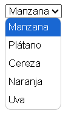

# HTML - select y option.

## Introducción:

Las etiquetas `select` y `option` en **HTML** se utilizan para crear controles de formulario que permiten a los usuarios seleccionar una o más opciones de una lista desplegable. Son esenciales para formularios que requieren la elección de elementos predefinidos.

## Etiqueta `select`.

La etiqueta `select` define un control de selección desplegable. Puede contener varias etiquetas `option` que representan las diferentes opciones disponibles para el usuario.

*Ejemplo de estructura basica:*

```HTML
    <select id="frutas" name="frutas">
        <option value="manzana">Manzana </option>
        <option value="platano">Plátano </option>
        <option value="cereza">Cereza </option>
        <option value="naranja">Naranja </option>
        <option value="uva">Uva </option>
    </select>
```

*Visualización en el documento:*



## Atributos de `select`.

- `name`: Define el nombre del control que se enviará con el formulario.

- `id`: Define un identificador único para el control, útil para vincular etiquetas `label`.

- `multiple`: Permite seleccionar múltiples opciones.

- `size`: Define la cantidad de opciones visibles en el cuadro de selección.

## Etiqueta `option`.

La etiqueta `option` se utiliza dentro de `select` para definir las opciones que los usuarios pueden elegir.

**Atributos de `option`**

- `value`: Define el valor que se enviará cuando se seleccione la opción.

- `selected`: Preselecciona la opción en la lista desplegable.

- `disabled`: Desactiva la opción.
